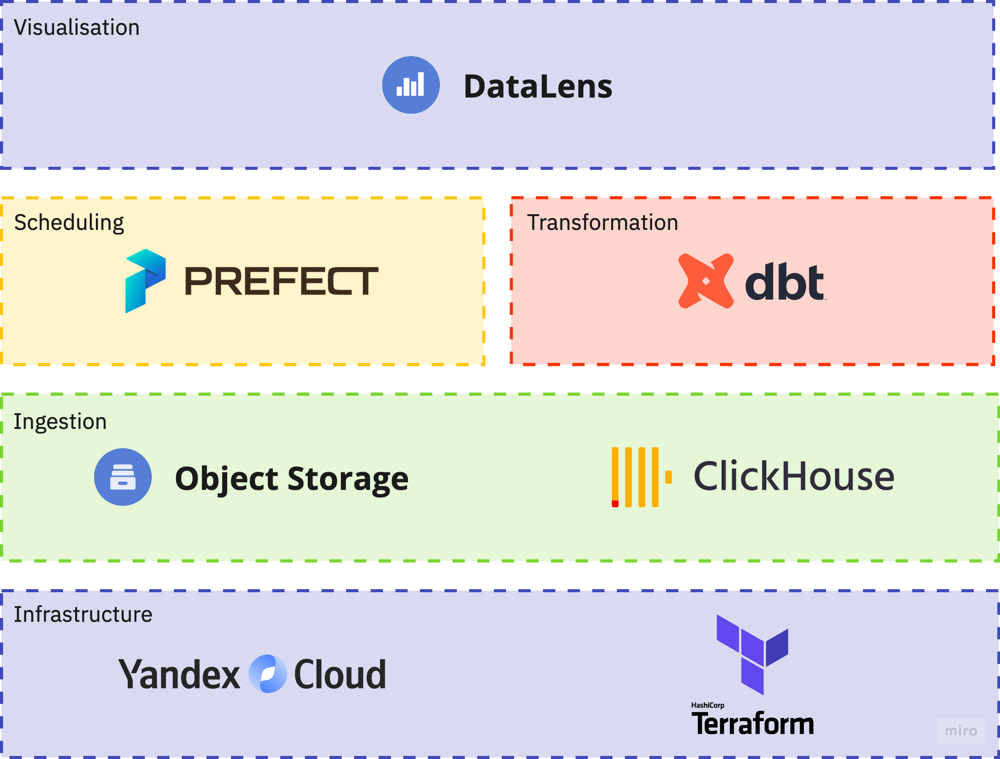
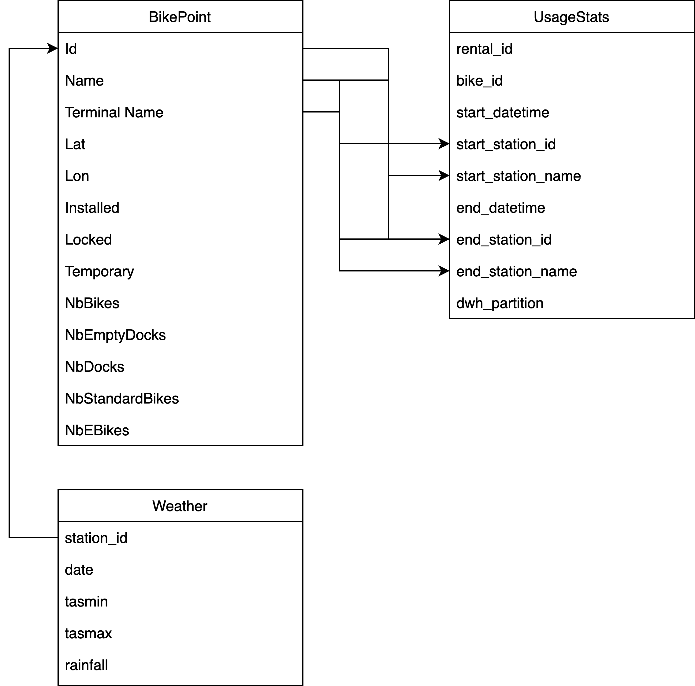
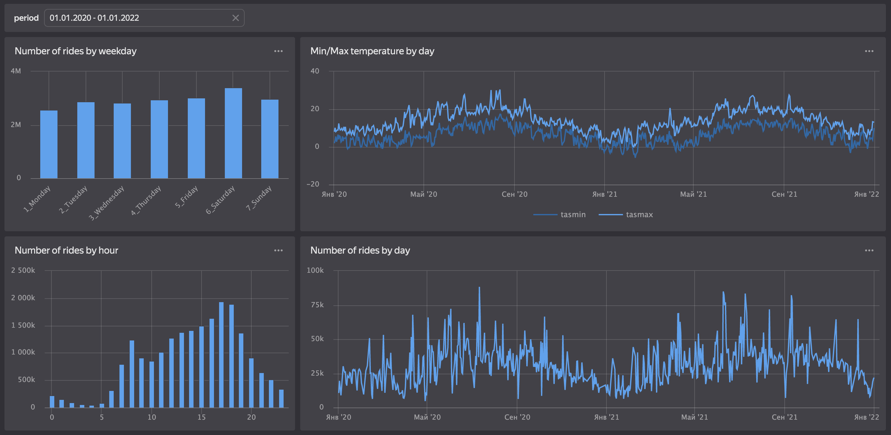
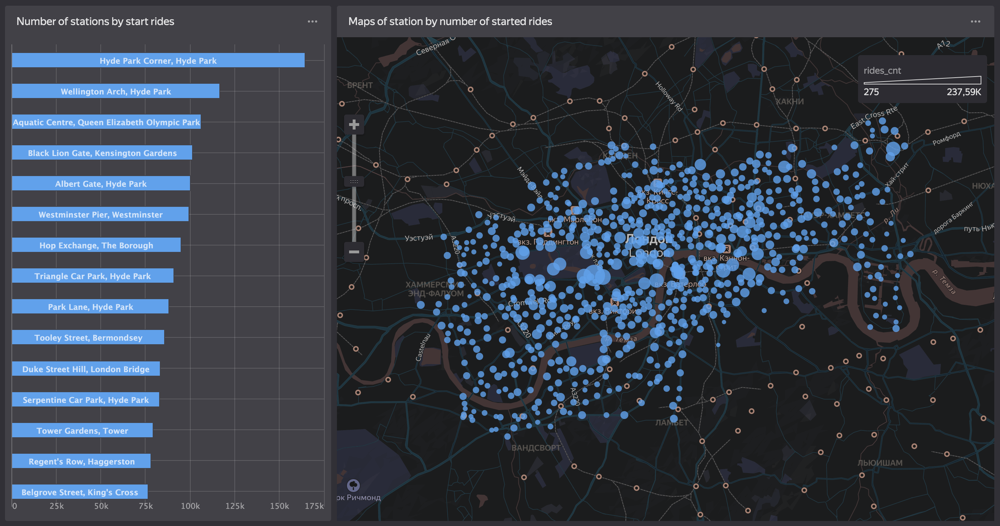

# Transport for London Santander Cycles Data Pipeline

In partnership with Santander, Transport for London (TfL) provide a public cycle hire scheme in London. Currently, there are up to 30,000 bikes available at over 700 docking stations, and since 2020 the number of trips taken on these bikes surpassed 33.5 million. TfL provides a unified [API](https://api-portal.tfl.gov.uk/api-details) that allows for the sharing of data across various transportation modes, as well as a historical data [bucket](https://cycling.data.tfl.gov.uk/) that records all journeys made since 2015.

This repository contains a batch processing pipeline that extracts TfL cycle data from multiple sources and joins it into a single database. The primary dataset contains, start and end time and location for each ride. Additionally, the pipeline integrates [weather data from the Met Office](https://catalogue.ceda.ac.uk/uuid/4dc8450d889a491ebb20e724debe2dfb). Weather observations (min/max temperature, raninfall) are measured on a uniform grid (5km by 5km). The pipeline merges weather data over time for each cycle station using its nearest point on the grid.

# Overview of the pipeline

Unfortunatelly Google Cloud and AWS are not available in my country, so [Yandex.Cloud](https://cloud.yandex.ru/) will be used as the computing platform.

In this README, an overview of the pipeline is provided; for further information, see the README files inside project's directories. The project is designed as shown on the diagram below. [Prefect](https://www.prefect.io/) is used for pipeline orchestration. All necessary data is ingested to Object Storage as soon as new partition is released. Saved data is put into [ClickHouse](https://clickhouse.com/) and transformed to data marts using [dbt](https://www.getdbt.com/). Finally, [Yandex DataLens](https://datalens.yandex.ru/) is used to visualise the data as a dashboard.

The pipeline solves a number of challenges. TfL's API is consistent, but doesn't provide historical data. Furthermore, the cycling data processed by the pipeline has bad consistency:
- some columns can be missing from one partition to another;
- `station_id` changes during the time;
- date columns format changes from file to file.

Additionaly, the weather data is stored in [NetCDF](https://www.unidata.ucar.edu/software/netcdf/) geospatial format, which needed to be transformed to a compatible data type and integrated with the cycles data using latitude and longitude.

## Scheduling

[Prefect](https://www.prefect.io/) is used for scheduling. You can find the instructions how to setup it [here](prefect/README.md).

There are several flows created for data ingestion:
- [`etl_usagestats_to_s3`](prefect/flows/etl_usagestats_to_s3.py) – loads riding data from [TfL's bucket](https://cycling.data.tfl.gov.uk/) and saves it to Yandex Object Storage (S3) in a unified parquet format;
- [`etl_usagestats_to_ch`](prefect/flows/etl_usagestats_to_ch.py) – copies parquet table with bike rides from S3 to ClickHouse;
- [`etl_bikepoints_to_s3`](prefect/flows/etl_bikepoints_to_s3.py) – loads realtime bike stations' data from [TfL's API](https://api-portal.tfl.gov.uk/api-details) and saves it to S3;
- [`etl_bikepoints_to_ch`](prefect/flows/etl_bikepoints_to_ch.py) – copies parquet table with bike stations data from S3 to ClickHouse;
- [`etl_weather_to_s3`](prefect/flows/etl_weather_to_s3.py) – loads weather data from [CEDA Archive](https://catalogue.ceda.ac.uk/uuid/aeb4ca481d634ec597831282c3baed32), joins weather grid values to bike stations positions, saves table to S3.
- [`etl_weather_to_ch`](prefect/flows/etl_weather_to_ch.py) – copies parquet table with weather on sations from S3 to ClickHouse.

Also there is [`trigger_dbt_flow`](prefect/flows/trigger_dbt_flow.py) flow that updates tables and datamarts accessed by users.

All flows are run daily and has convinient time gaps between dependent flows to keep all data up to date.

## Database

[ClickHouse](https://clickhouse.com/) was chosen a data storage, because:
- it has naitive integration with Yandex.Cloud;
- it is a column database that allows to execute vectorized computations and to store data effectively (compressed and partitioned);
- it has high availability and fault tolerance;
- it can effectively scale up both vertically and horizontally;
- it is a standard for logs and event data processing tasks.

ClickHouse can be considered as a closest analog for Big Query.

The relations between tables in ClickHouse can be considered as follows:

Table `bike_point` has:
- `Id` as a primary key;
- `TerminalName` as a surrogate key.

It's a small table, it has ~700 records, so should be optimized. ClickHouse provides special format for such kind of tables, see [Dictionaries](https://clickhouse.com/docs/en/sql-reference/dictionaries), however in this pipeline this optimisation hasn't been done.

Table `weather` has:
- `(date, station_id)` as a primary key (used for ordering);
- `toYYYYMM(date)` as a partition key.

The partition key is chosen like this because raw weather data is partioned by months, so it's easy to update table using the same partition key.

Table `usage_stats` has:
- `rental_id` as a primary key;
- `dwh_partition` as a partition key;
- `start_datetime` as an ordering key.

The partition key is chosen like this because TfL's raw data is partioned by week number since the measuring has started, so it's easy to update table using the same partition key.

There is one **important** and **unpleasant** aspect with `usage_stats` table. Due to the structure of raw historical riding data the `start_station_id` and `end_station_id` value somewhere changed from `Id (bike_point)` to `TerminalName (bike_point)`.

This problem is fixed with [dbt](https://www.getdbt.com/) model, that creates fixed `stg_rides_info` table for end users. This table has:
- `rental_id` as a primary key;
- `toYYYYMMDD(start_datetime)` (day when ride started) as a partition key;
- `start_datetime` as an ordering key.

Also there are some datamarts created for creating the dashbords: `cnt_rides_per_day`, `duration_per_bike`, `popular_rides`.

## Dashboards

To demonstrate how the pipeline can be used for analytics, [Yandex DataLens](https://datalens.yandex.ru/) was used to create a simple dashboard. The [dashboard](https://datalens.yandex/9nbvasahg09yz?state=ee835f90157) will be available till the course ends.

You can use the period of time you are interested in (rides history is available since January 2020, and weather info since Januray 2020 till December 2022). The locations of the docking stations are shown on Yandex Maps.

Using this dashboard we can find out some insights:
- there is a correlation between weather temperature and number of rides (people prefer warm weather for their rides);
- the most popular day for rides is Saturday;
- there are 2 peaks at 8AM (people are riding to work) and 5-6PM (people are riding back at home);
- bikes are available all day long, so there are little trips even at night;
- the most popular stations where a ride starts are in the center of London.

## Pipelines setup

For a more detailed explanation of the pipeline and instructions on how to setup the pipeline yourself, refer to the following documents:

1. [Setup](terraform/README.md)
2. [Data ingestion](prefect/README.md)
3. [Data transformation](dbt/README.md)

There is also a more [detailed description](datasets.md) of the datasets processed by the pipeline.

# License

The data processing pipeline is licensed under the GNU General Public License v3.0 (see [LICENSE](LICENSE) file for licensing information).

The bike rental data is [powered by TfL open data](https://tfl.gov.uk/corporate/terms-and-conditions/transport-data-service). These data contain Ordnance Survery-derived data (© Crown copyright and database rights 2016) and Geomni UK Map data (© and database rights 2019).

Weather data was obtained from the [CEDA Archive's HADUK-Grid regional climate observations](https://catalogue.ceda.ac.uk/uuid/4dc8450d889a491ebb20e724debe2dfb), licensed under the [Open Government Licence](https://www.nationalarchives.gov.uk/doc/open-government-licence/version/3/).
